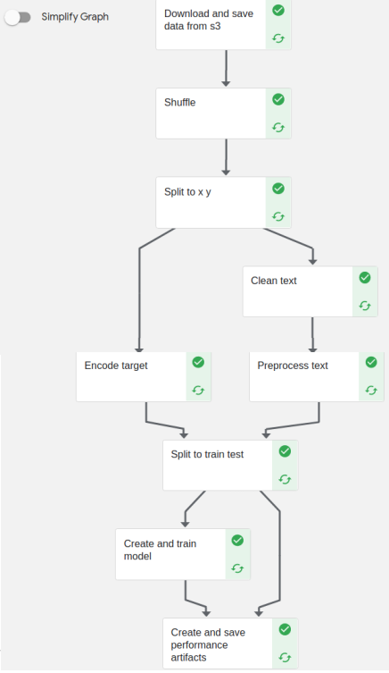

# kubeflow-imdb
This is a project to demonstrate how to create a Kubeflow pipeline. Kaggle's [IMDB](https://www.kaggle.com/datasets/lakshmi25npathi/imdb-dataset-of-50k-movie-reviews) dataset was used and the pipeline was set up to perform tasks such as cleaning and preprocessing the text, training the model, and retrieving performance data and artifacts. Below the graphical layout of the pipeline.

The script for the pipeline is ```imdb_pipeline.py``` and it calls the functions for the pipeline components from the ```/functions``` directory.

The Dockerfile used to build the base image for the components can be found in the ```/dockerfile``` folder and the artifacts from a run (and the config of that run) can be found in the ```artifacts``` folder. 


